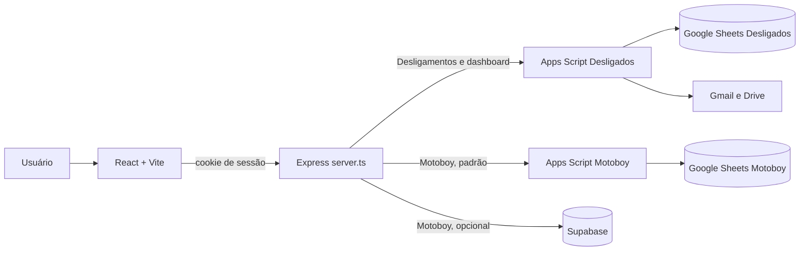

# Arquitetura

| Campo | Informação |
| --- | --- |
| Classificação | Uso interno |
| Proprietário | Equipe de TI |
| Aprovador | Gestão de TI |
| Revisão | Trimestral ou quando houver mudança arquitetural |
| Fontes | `server.ts`, `src/` e `apps-script/` |

## Escopo

O sistema reúne dois fluxos independentes, acessados pela mesma aplicação:

1. Desligamentos e devolução de ativos.
2. Solicitações logísticas de Motoboy.

O frontend não acessa Google Sheets ou Supabase diretamente. O backend Express autentica a sessão, valida o payload e escolhe a integração de persistência.

## Componentes

| Componente | Responsabilidade | Dependências |
| --- | --- | --- |
| `src/App.tsx` | Login, navegação e formulário de devolução. | API Express. |
| `src/components/Dashboard.tsx` | Indicadores e atualização periódica. | `GET /api/dashboard-data`. |
| `src/components/Motoboy.tsx` | Criação, atualização, exclusão e histórico logístico. | API Motoboy. |
| `server.ts` | Sessão, autorização, validação Zod, cache e integrações. | Express, Apps Script, Supabase opcional. |
| `apps-script/Desligados-prod.gs` | Registro, consolidação do dashboard e importação de e-mail. | Sheets, Gmail, Drive. |
| `apps-script/Controle-Motoboy-homologacao.gs` | CRUD da planilha de Motoboy. | Sheets e LockService. |

## Fronteiras e decisões

- **Autenticação:** o backend cria uma sessão `cookie-session` após comparar a senha recebida com as variáveis `TI_PASSWORD`, `RECEPTION_PASSWORD` e `MARIA_PASSWORD`. A sessão tem validade de 15 minutos.
- **Autorização Motoboy:** os e-mails fixos em `getMotoboyRole` definem `suporte`, `recepcao` ou `none`. Suporte cria; Recepção atualiza; ambos excluem com justificativa.
- **Desligamentos:** os dados são persistidos exclusivamente via Apps Script. O cache do dashboard fica no processo Node por dois minutos.
- **Motoboy:** `MOTOBOY_STORAGE=supabase` escolhe Supabase; qualquer outro valor usa Apps Script. O cache é por papel e dura um minuto.
- **Concorrência em planilhas:** os mutadores dos Apps Scripts usam `LockService` para serializar escrita.

## Fluxos de integração

### Registro de devolução

1. A Recepção autentica e envia colaborador, equipamentos e situação.
2. Express exige sessão, remove campos não previstos e valida tamanhos.
3. O backend envia `payload` codificado como formulário ao Apps Script.
4. O script localiza o colaborador em todas as abas mensais ou cria uma linha.
5. O backend invalida o cache do dashboard após sucesso.

### Dashboard

1. O frontend consulta o backend ao abrir a tela e a cada 15 segundos.
2. O backend responde do cache válido ou chama `getDashboardData` no Apps Script.
3. O script agrega apenas registros da filial Barra Funda e devolve métricas, pendências e devoluções recentes.

### Motoboy

1. O frontend consulta solicitações a cada 30 segundos.
2. Express determina o papel a partir da sessão e aplica a regra da rota.
3. O adaptador selecionado grava ou lê Apps Script/Sheets ou Supabase.
4. Exclusões são lógicas: status `Excluído`, justificativa, autor e data.
5. No Supabase, eventos `created`, `updated` e `deleted` são gravados em `motoboy_request_events`; no Apps Script o histórico retorna vazio.

## Riscos e recomendações

Fatos observados no código:

- `SESSION_SECRET` possui valor padrão no código se a variável não for definida.
- O cookie de sessão está com `secure: false`; em produção HTTPS isso deve ser reavaliado antes de tratar a aplicação como pronta para internet pública.
- O backend usa chave `SUPABASE_SERVICE_ROLE_KEY`; ela deve permanecer somente no servidor e nunca ser exposta ao bundle Vite.
- A limpeza de exclusões do Motoboy ocorre apenas na ramificação Supabase; Apps Script mantém registros excluídos na planilha.

Recomendação: documentar e revisar a configuração de ambiente por deploy, rotacionar segredos periodicamente e manter o Apps Script Motoboy separado do Apps Script de Desligados.
