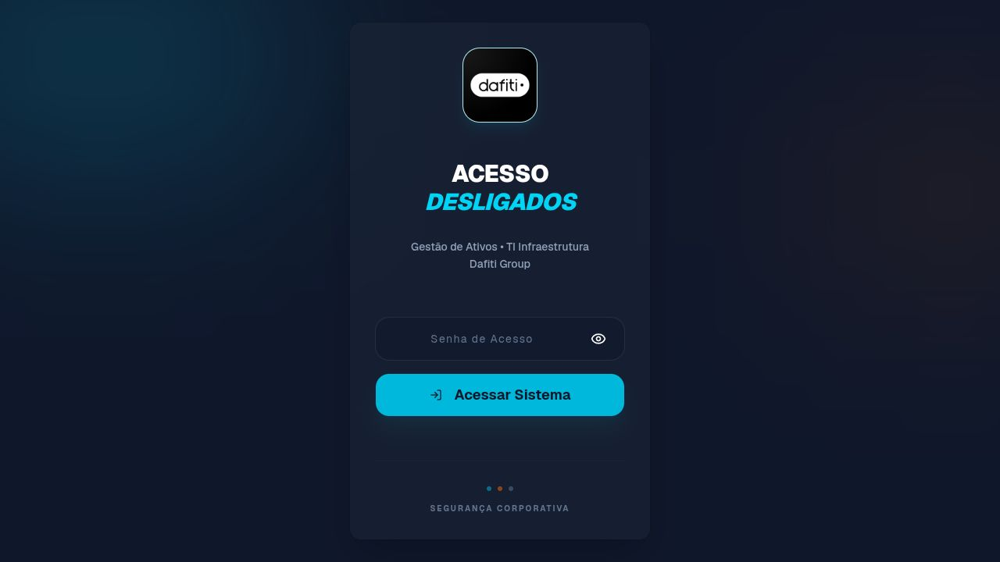
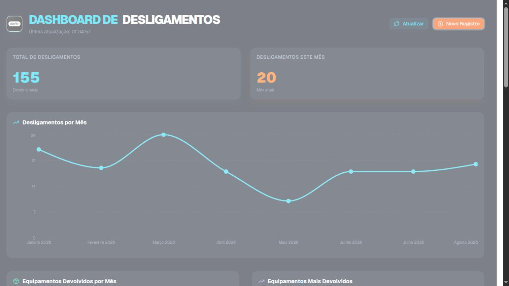
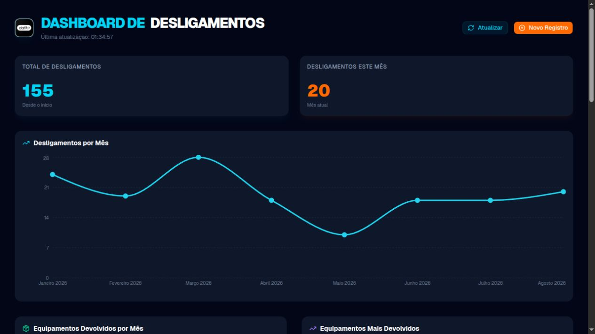
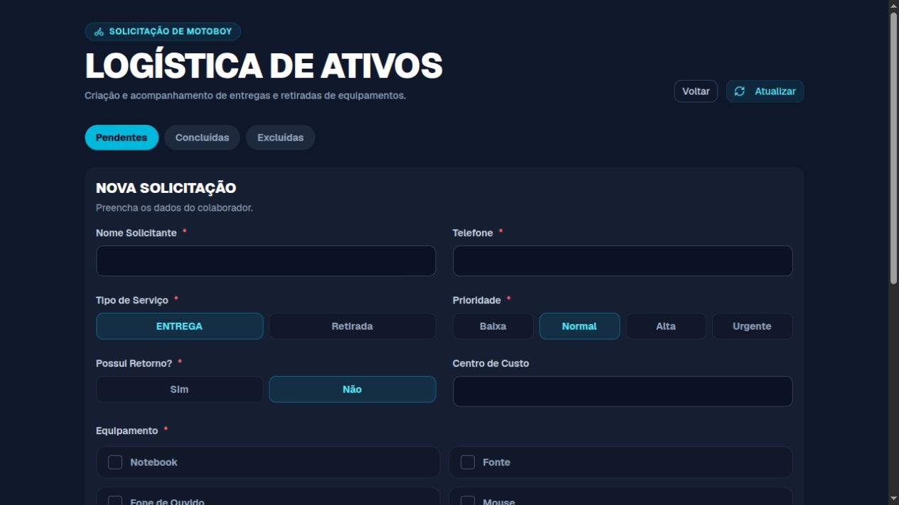

# Telas da Plataforma

| Campo | Informação |
| --- | --- |
| Classificação | Uso interno |
| Proprietário | Equipe de TI |
| Aprovador | Gestão de TI |
| Revisão | A cada alteração relevante de interface ou fluxo |
| Ambiente de captura | Ambiente local de testes |
| Data de captura | 28/08/2026 |

## Uso das imagens

As imagens desta página apoiam treinamento, validação de interface e futura publicação no Confluence. Foram capturadas com credenciais temporárias em ambiente local. Antes de uma nova publicação, confirme que não há dados pessoais, solicitações reais, endereços, telefones, e-mails de pessoas ou informações operacionais sensíveis visíveis.

## Acesso

Tela inicial da aplicação. O acesso é feito por senha e estabelece a sessão que protege os fluxos internos.

## Registro de desligados

Formulário usado para registrar a devolução de equipamentos ou o desligamento de colaboradores. Consulte a [arquitetura de informação](information-architecture.md) para as regras do processo e o [modelo de dados](data-model.md) para os campos registrados.

## Dashboard

Visão operacional de indicadores e pendências de devolução. Os números exibidos dependem do Apps Script configurado no ambiente e devem ser tratados como informação interna.

## Motoboy

Formulário de criação e acompanhamento de solicitações de coleta e entrega de ativos. O fluxo é restrito por papel; detalhes de permissões estão na [arquitetura de informação](information-architecture.md).

## Atualização de evidências visuais

Atualize os screenshots quando uma mudança alterar a navegação, o texto, a estrutura dos formulários, os controles de acesso ou a aparência de uma tela crítica. Registre a atualização junto da mudança de produto e revise esta página conforme a [governança da documentação](governance.md).
